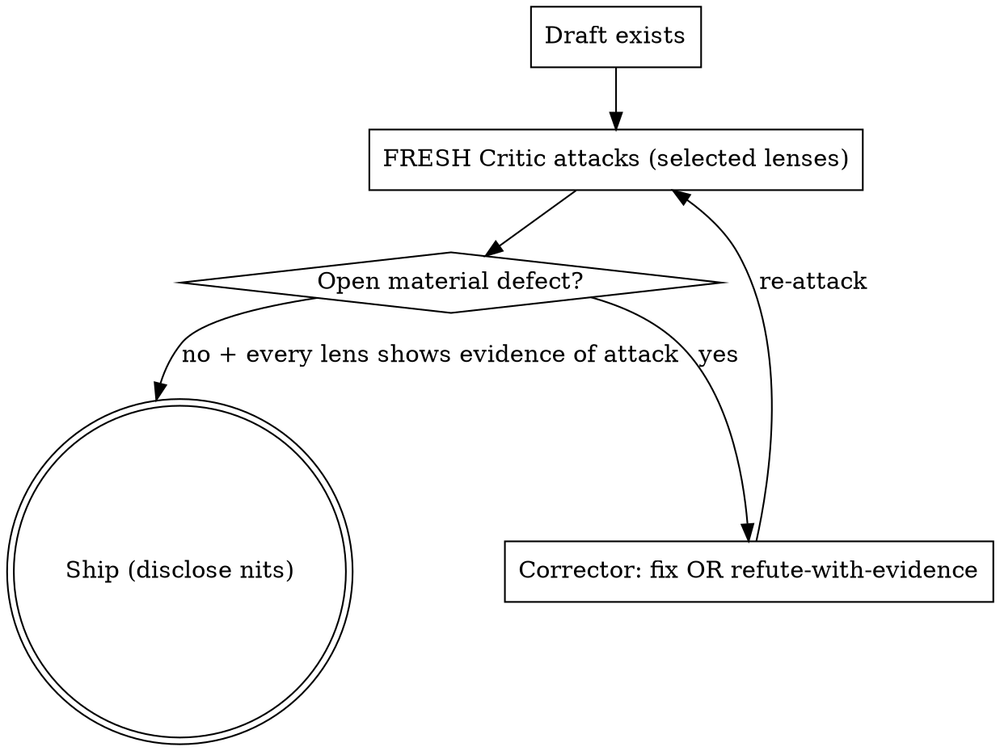

# Due Diligence

## Overview

Work is ready only when **a hostile reviewer can find no material defect** — not when it "looks fine." This covers **both** the deliverable a reader sees **and** the code/operations behind it: a tool that silently drops data, mishandles an input, or misses context is defective even if its output looks clean — you want to catch that yourself, before a reviewer (or your boss) does. Get there by running an adversarial **Critic ↔ Corrector loop to convergence**. It targets the defects that skeptical reviewers *and real-world use* expose: fabricated/unverifiable data, **silent data loss or incomplete processing**, wrong results, unhandled inputs, superfluous filler, unexplained jargon, internal contradictions, and usability gaps.

**Core principle: "looks fine" is a Critic failure, not a pass.** The Critic assumes defects exist and must show it attacked — not assert it found nothing.

**Material defect = a blocker or should-fix.** Nits don't block shipping — list them and move on.

## When to use

- Before declaring any work "done" or sending it onward.
- **Auditing whether code, a pipeline, or a process actually works** — completely and correctly, on real inputs — not just reviewing a document.
- Any AI-generated artifact going to a skeptical human.
- When asked to make something "perfect", "production-ready", "boss-proof", "break it".

Skip only for throwaway scratch with no reader.

## Calibrate effort first — auto, steerable (do this before attacking)

Fan-out and re-attack are **token-expensive**; spend them only where stakes/size
earn it. **Self-determine the cheapest tier that fits**, then **state in one line
which tier you picked and why.** The user can override: if they name a tier or signal
intensity ("quick check" / "one critic" / "go deep" / "bulletproof" / "break it"),
obey that over your auto-pick.

- **Skip** — throwaway scratch, no real reader.
- **Light (DEFAULT — use unless something pushes you up):** ONE fresh-eyes pass
  covering all selected lenses in a single turn; ONE fix cycle. Most deliverables land
  here.
- **Standard:** one fresh **sub-agent** critic (all selected lenses in the one agent);
  re-attack **once**, only if it found a blocker. For a real boss/client/external
  deliverable.
- **Heavy:** one critic **per selected lens in parallel** + re-attack **to convergence**. Use
  ONLY when at least one holds: the user asked for it; the change is
  irreversible/high-stakes/embarrassing-if-wrong; OR the artifact is too large to
  fit one critic's context. This is the expensive setting — don't reach for it by
  reflex.

Auto-pick heuristic: start at Light; go Standard if a skeptical external reader will
scrutinise it; go Heavy only on the explicit triggers above.

## Step 0 — Establish context first (ask if unknown)

Applies to any artifact — report, email, dataset, slide, spec, code — **with or without a codebase**. Before critiquing, determine these; if not given, **ask the user**:

1. **What produced it?** A human, a specific AI/model, a pipeline, or a mix. Treat AI-generated facts as **unverified by default** — require a trace before trusting any figure, name, or quote.
2. **What is it for?** The decision it supports, the audience (boss? client? public?), the medium, and any length/format constraints.
3. **What type is it? (emit tags)** From this closed set, tag the artifact — the tags surface candidate domain lenses:
   `code, config, data-export, llm-pipeline, rendered-ui, data-analysis, multi-file, doc-describes-code, deploy, migration, infra, pipeline, cron, external-send, proposal, plan, recommendation, runbook, educational`.
   A plain prose report with none of these → no tags; select from the general lenses per-case (below).

These feed lens selection (below): Q1 informs whether provenance applies, Q2 sets the bar for necessity/clarity, Q3's tags surface candidate domain lenses. Without Step 0, "necessary" and "clear" have no defined bar.

## Lens selection (per-case, per-artifact)

**No lens is automatic.** For each artifact, select the lenses it actually needs by
reasoning about *what it is* and *how it could fail* — never bolt on a fixed set. Two
pools, chosen the same way:

- **General lenses** apply to *most* artifacts but are selected per-case, not forced —
  take each only where the artifact has that failure surface (e.g. skip provenance for a
  UI mockup with no data/claims; skip operational-completeness for a static blurb with
  nothing to "run"). All nine are files in `references/lenses/` (opened on demand);
  roster below.
- **Domain lenses** (`references/lenses/<name>.md`) selected by relevance; the tag table
  below is a fast starting point for candidates, not the whole decision. Consult each
  selected lens's cited `references/res_*.md` for the standard it checks against; open
  only the selected ones.
- **User lenses (the extension point)** — also scan `.dd/lenses/*.md` in the working repo
  (and any hub root) for the user's own lenses. Read each candidate's `## Fires on` to
  decide relevance per-case, exactly like a shipped lens; back them with the user's
  `.dd/res/*.md` where cited. **Precedence:** a user lens whose filename matches a shipped
  lens *overrides* it (the user's version wins) — this is how a user changes how an
  existing lens behaves without editing the plugin. A new name is a new lens. `.dd/` lives
  in the user's repo and is only ever read here, so plugin updates never touch it. If no
  `.dd/` exists, this is a no-op.

**General lens roster (select per-case):**

| Lens | Select when |
|---|---|
| data-provenance | any figure/name/date/quote/claim to trace |
| necessity | prose that could carry filler |
| clarity | any reader-facing text |
| operational-completeness | anything that "runs" or processes input |
| audience-fit | reader's expertise/role known, level-match matters |
| structure-navigability | multi-section doc a reader must navigate |
| voice | prose, esp. AI-generated (AI-tells) |
| actionability | meant to drive a decision/action |
| depth-sufficiency | substantive claims/recommendations (inverse of necessity) |

(All nine are files in `references/lenses/`, opened only when selected.)

| Tag | Domain lenses added |
|---|---|
| code | security-secrets, dependency-supply-chain, reproducibility-portability, performance-efficiency, maintainability, error-handling, test-coverage, concurrency-safety, resilience, api-contract |
| config | security-secrets |
| data-export | security-secrets, data-privacy, data-quality |
| llm-pipeline | prompt-injection, output-grounding, cost-token-efficiency, resilience, llm-eval |
| rendered-ui | visual-ui-ux, deep-accessibility, brand-consistency |
| data-analysis | statistical-soundness, data-quality, data-privacy |
| multi-file, doc-describes-code | cross-artifact-consistency, api-contract |
| deploy, migration, infra | rollback-blast-radius, reproducibility-portability, observability, backup-recovery |
| pipeline, cron, infra | idempotency-rerun-safety, observability, concurrency-safety, resilience |
| runbook | reproducibility-portability |
| external-send | compliance-policy, data-privacy |
| proposal, plan, recommendation | assumptions-risk, alternatives-considered |
| educational | pedagogy |

A tag appearing in two rows contributes both lenses — e.g. an `infra` artifact surfaces
*both* rollback-blast-radius and idempotency-rerun-safety.

**Selection guard — make every choice visible (state it in one line before attacking):**
name the lenses you selected AND explicitly name any general lens you deliberately
*skipped*, each with a one-line why. A per-case model's failure mode is *silently*
dropping a relevant lens — skipping is allowed, omitting-without-saying is not. e.g.
*"Tags: rendered-ui → visual-ui-ux, deep-accessibility, brand-consistency + clarity,
necessity; skipped provenance (no data/claims) and operational-completeness (static
page)."* Then run the tier's loop (below) over the selected set.

## The loop

**Run a FRESH Critic — how (per the calibrated tier):**
- **Light:** a single-context fresh Critic turn (or one sub-agent) covering all selected
  lenses — given ONLY the artifact + lenses + Step 0, re-deriving every claim from
  scratch.
- **Standard:** ONE fresh sub-agent (Agent/Task tool) given ONLY the artifact + selected
  lenses + Step 0 — NOT the authoring rationale.
- **Heavy ONLY:** dispatch one critic **per selected lens in parallel** (the expensive mode).
  Reserve for Heavy-tier triggers — or when the artifact genuinely won't fit one
  critic's context.
- State which mode you used. **Never let the Corrector grade its own homework.**

## The general lenses

The four foundational general lenses — **data-provenance, necessity, clarity,
operational-completeness** — are files in `references/lenses/` like every other lens,
opened on demand (not loaded here, so an artifact that doesn't need one doesn't pay for
it). Select them per-case per "Lens selection"; the roster there lists all nine general
lenses and when to take each. data-provenance and operational-completeness are DD-core
(trace-or-delete; does-it-actually-work); necessity and clarity cite `res_technical-writing.md`.

## Critic output

Per defect, in this order:
1. **Plain-language lead (one sentence, no jargon):** what the problem *means* and **what goes wrong if it's not fixed** — in terms the user understands, whether the problem is in the output *or* in how the code/system behaves. e.g. *"The tool only reads part of each thread, so it can miss the reply that turns a complaint into a balanced view — and nothing flags that it happened."* Define or avoid technical terms.
2. **Detail (for whoever fixes it):** quote the offending text/code (+ location). The user can skip this.
3. **Severity** in plain terms: *blocker* = "produces a wrong result, loses data, or would mislead/embarrass the reader"; *should-fix* = "rough edge real use will hit"; *nit* = "polish".
4. **The concrete fix.**

Vague complaints ("could be clearer") are rejected — point at the words/code. For a lens with **no** defect, state what you checked and why it passed (not just "clean") — that is the evidence-of-attack the ship gate requires.

## Reporting back (plain language first)

When you summarise to the user, **lead with a 2–3 sentence plain-English bottom line** — is it ready, and the biggest real-world risks (functional *and* presentational), no jargon. Then list findings, each opening with its plain-language lead. Keep technical detail present but clearly secondary (a "Detail:" line) so a non-technical reader gets the whole picture without decoding it. They should never have to ask "what does this mean for me?"

## Corrector & convergence

- Fix the defect, **or** refute it with evidence (quote the source / show the logic). "It's fine" is not a refutation.
- **Re-attack policy is tier-scoped** (re-attacks are where cost compounds):
  - **Light:** one fix cycle, no re-attack. Fix the material defects from the single
    pass and ship.
  - **Standard:** re-attack **once**, and only if the first pass found a *blocker*.
  - **Heavy:** re-attack with a fresh Critic until convergence — fixes create new
    defects.
- **Ship when** the tier's passes find no open blocker/should-fix **and** every lens
  showed evidence of attack. Disclosed nits and evidence-refuted items don't block.
- **Stop rule:** if a defect (same root issue, even if re-worded) survives 3 full loops, or two passes disagree on severity, escalate to the user with the artifact + both positions. Severity ties resolve upward (treat as should-fix pending the user's call).

## When you catch yourself thinking…

| Thought | Reality |
|--------|---------|
| "It looks fine / polished" | Polish hides defects. A clean pass needs evidence of attack on every selected lens. |
| "I'll just add a citation" | Can't name a real source? The data may be invented. Trace or delete — never fabricate a cite. |
| "The reader will understand" | If they could ask what / where-from / how, it's a defect. |
| "I reviewed it myself" | Authors are blind to their own work. Use a fresh Critic. |
| "One pass / good enough to send" | Fixes create defects; the bar is "no material defect", not "good enough". |

## Adding or changing a lens

**Your own lenses (update-safe — the normal path for users):** drop them in `.dd/` in your
repo, never inside the plugin. `.dd/lenses/<name>.md` (same template as below) is picked up
automatically by the per-case scan; `.dd/res/<domain>.md` backs it. Name it after a shipped
lens to **override** that lens's behavior; use a new name to add one. A lens declares when it
applies in its own `## Fires on`, so no table edit is needed. Plugin updates never touch
`.dd/` — this is the tier you own.

**Template:** `# <name> — <what it reviews>` / `> Cites: res_<domain>.md` (or "internal" if
no external standard) / `## Fires on` / `## Attacks` / `## Evidence of attack` /
`## Severity guide`. Draw the Attacks from the cited `res_` file; don't invent.

**Contributing a lens upstream (into the plugin itself):**
1. Write `references/lenses/<name>.md` per the template above.
2. If it needs a new knowledge base, add `references/res_<domain>.md` first (research-backed) and cite it.
3. Add one row, or extend a tag row, in the **Lens selection** table above.

Either way — no dispatcher code to touch.
